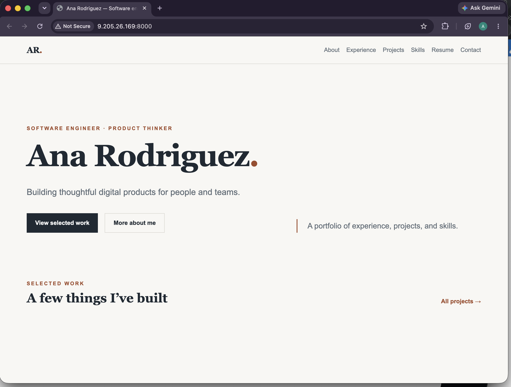

# Exercise 03 — Evidence

## 1. VM details

| Field | Value |
|---|---|
| Name | `vm-career-platform` |
| Resource group | `rg-career-platform` |
| Region | `denmarkeast` |
| Size | `Standard_B2ats_v2` |
| Public IP | `9.205.26.169` |

## 2. Screenshot

## 3. What went wrong

I ran into some small problems while setting up the server. At first, I couldn't reach port 8000 from my computer. My `curl` request did not fully go through and timed out after 5 seconds with no error. When I checked the azure inbound rules with `az network nsg rule list`, I found it only had one rule, which allowed the SSH from my laptop. It seems like azure quietly drops traffic that doesn't match a rule instead of rejecting it, which is why my request was not fully right. 

I also found that my migration plan had information that wasn’t true to what my branch had. But this was already listed as a possible issue regarding the uv.lock data, so I went and followed those steps before implementing the plan. Additionally, the verify section said an external `curl` to port 8000 had worked and listed specific database row counts. I re-ran the inbound port rule and the external `curl` test myself, and I confirmed twice that no port 8000 rule ever existed and that the app was only working locally, so that section was corrected before committing.

## 4. You're at a coffee shop and try to SSH into your VM to fix a typo. The command hangs.

The VM's inbound port only allows SSH from one specific IP address, which is the one I set up from home. At the coffee shop I have a different public IP, so the port drops my connection. I don't get an error, it just waits until it times out, which is the same thing that happened earlier with `curl` to port 8000 before I added that inbound port rule.

To fix it, I would log into the portal and change the rule to use the coffee shop's current public IP. The only cost will be the time it would take me to make that change, since adding an inbound rule does not cost any money.